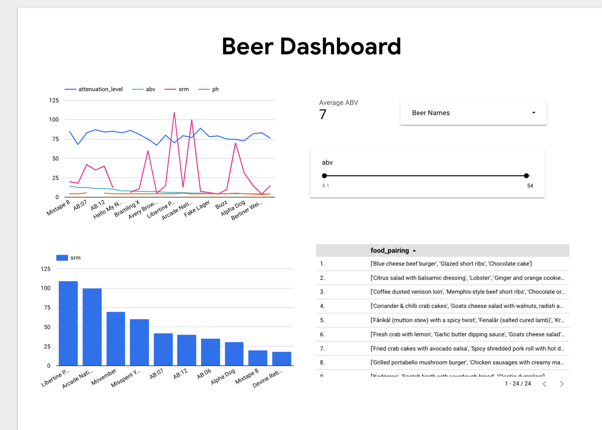

# ETL BeerPipeline

This is a pipeline that directly extracts data from an api, transforms the data into different tables and loads them to bigquery.

## Softwares used

- This project uses python as the engineering language. 
- Collab notebook for transformation 
- Mage.ai for orchestration of pipeline - https://www.mage.ai/
- Virtual Machine to hold the Orchestrator
- Big Query 
- Looker Studio as a reporting and visualization tool

## Data Used

The data is found from an API documented here. 
API(https://punkapi.com/documentation/v2) 

## Relationship Diagram from Data Modelling

## Extraction
The data is extracted by making a get request to the API endpoint and saving the result. 

## Transformation
The data is then transformed and split into the defined fact table and dimensional table formed from data modelling. The tables are formatted and oriented as a dict.
A mage pipeline automates the ingestion process from the api and uses the transformations in python to prep the data

## Load
The pipeline then loads the data to BigQuery. A datawarehouse for easy analysis and querrying of the data. This is then easily linked to a looker studio sheet. Some modifications are made to prepare summaries of the figures and describe the data from a consolidated table.

## Reporting
A brief report is created using looker studio with the figures we have for the different beers.

## Contributing

Pull requests are welcome. For major changes, please open an issue first
to discuss what you would like to change.

Please make sure to update tests as appropriate.

## License

[MIT](https://choosealicense.com/licenses/mit/)
